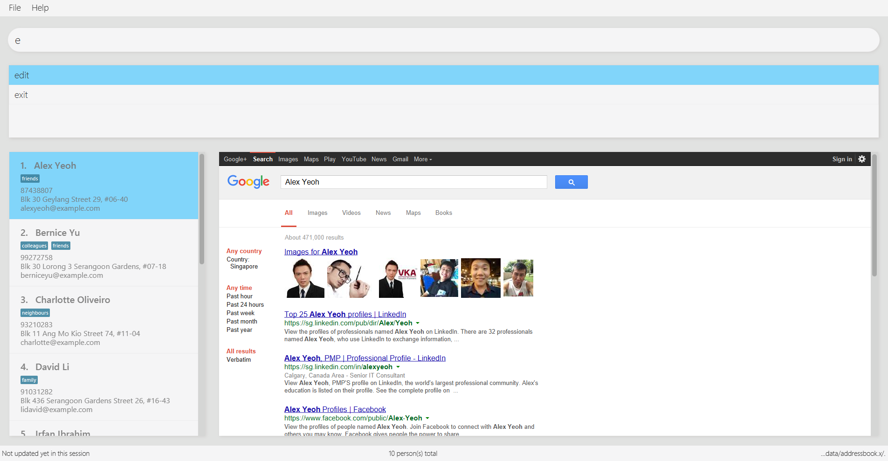

= CYNC
ifdef::env-github,env-browser[:relfileprefix: docs/]
ifdef::env-github,env-browser[:outfilesuffix: .adoc]

image:https://travis-ci.org/CS2103AUG2017-W15-B2/main.svg?branch=master["Build Status", link="https://travis-ci.org/CS2103AUG2017-W15-B2/main"]
https://ci.appveyor.com/project/CS2103AUG2017-W15-B2/main[image:https://ci.appveyor.com/api/projects/status/gtfadbmd0ta66698?svg=true[Build status]]
https://coveralls.io/github/CS2103AUG2017-W15-B2/main?branch=master[image:https://coveralls.io/repos/github/CS2103AUG2017-W15-B2/main/badge.svg?branch=master[Coverage Status]]
image:https://api.codacy.com/project/badge/Grade/19508feb58074d319859aa3918dfee7c["Codacy code quality", link="https://www.codacy.com/app/zameschua/main?utm_source=github.com&utm_medium=referral&utm_content=CS2103AUG2017-W15-B2/main&utm_campaign=Badge_Grade"]

ifdef::env-github[]

endif::[]

ifndef::env-github[]
image::/docs/images/Ui.png[width="600"]
endif::[]

* This is a desktop application modified from AddressBook-Level4 project by SE-EDU initiative. It has a GUI but most of the user interactions happen using a CLI (Command Line Interface).
* It is a Java application intended for small businesses to manage customer data.
* Support for _Build Automation_ using Gradle and for _Continuous Integration_ using Travis CI.

== Site Maps

* <<UserGuide#, User Guide>>
* <<DeveloperGuide#, Developer Guide>>
* <<AboutUs#, About Us>>
* <<ContactUs#, Contact Us>>

== Acknowledgements

* Some parts of this sample application were inspired by the excellent http://code.makery.ch/library/javafx-8-tutorial/[Java FX tutorial] by
_Marco Jakob_.
* Original source of the code i.e. AddressBook-Level4 project created by SE-EDU initiative at https://github.com/se-edu/

== Licence : link:LICENSE[MIT]
